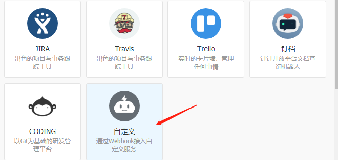
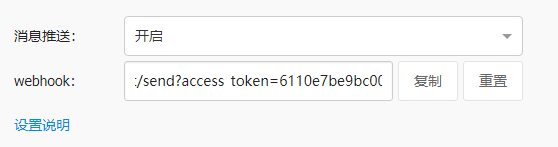

## alertmanager-dingtalk

[](https://microbadger.com/images/jrohy/alertmanager-dingtalk "Get your own image badge on microbadger.com")
1. add bot to dingtalk group  
    

2. get bot accessToken  
    

3. replace  '**accessToken**' to actual value and run command  
    ```
    docker run -d --name alertmanager-dingtalk --restart always -e accessToken="accessToken" -p 9166:9166 jrohy/alertmanager-dingtalk
    ```

4. add alertmanager webhook rule:  
    ```
    receivers:
    - name: 'alert-webhook'
      webhook_configs:
      - url: http://xx.xx.xx.xx:9166/alert
        send_resolved: true
    ```