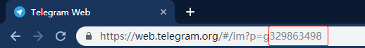

## alertmanager-telegram

[](https://microbadger.com/images/jrohy/alertmanager-telegram "Get your own image badge on microbadger.com")
1. create bot by [BotFather](https://telegram.me/BotFather),  get botToken  

2. add bot to group, open web telegram to get this group chatid  
    

3. replace '**botToken**' and '**chatId**' to actual value and run commmand  
    ```
    docker run -d --name alertmanager-telegram --restart always -e botToken="telegramBotToken" -e chatID="telegramChatID" -p 9165:9165 jrohy/alertmanager-telegram
    ```

4. add alertmanager webhook rule:  
    ```
    receivers:
    - name: 'alert-webhook'
    webhook_configs:
        - url: http://xx.xx.xx.xx:9165/alert
          send_resolved: true
    ```